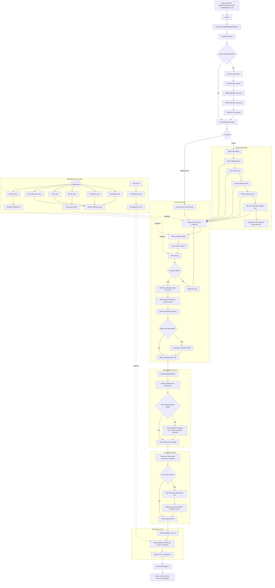

# Video Feed Recsys

## Scope

This document describes the active video feed recommendation feature implemented in `src/`.

Current API in scope:
- `GET /api/v1/recommend-with-metadata/{user_id}`

This feature builds a curated short-video feed for one user at a time. It uses ClickHouse as the source of truth for feed candidate data, KVRocks as the serving-state store, and request-time enrichment for metadata, view counts, and AI-influencer tagging.

## What The Feature Does

For a given `user_id`, the service:
- selects a batch of candidate video IDs from user-specific KVRocks pools
- filters out videos that should not be repeated or shown
- mixes content from following, UGC, popularity, freshness, and fallback sources
- resolves video metadata
- resolves cached or live view counts
- attaches `from_ai_influencer`
- returns the final feed response

## Public API

- Route: `/api/v1/recommend-with-metadata/{user_id}`
- Query params:
  - `count`: `1..500`, default `20`
  - `rec_type`: `mixed | popularity | freshness | following | ugc | fallback`, default `mixed`

Response shape:
- `user_id`
- `videos`
- `count`
- `sources`
- `timestamp`

Per-video fields:
- `video_id`
- `canister_id`
- `post_id`
- `publisher_user_id`
- `num_views_loggedin`
- `num_views_all`
- `from_ai_influencer`

## Source Of Truth And Runtime Stores

### ClickHouse reads

The feed feature reads from:
- `video_unique_v2`
- `global_popular_videos_l7d`
- `ai_ugc`
- `bot_uploaded_content`
- `ugc_content_approval`
- `user_video_relation`
- `follower_graph`
- `video_statistics`
- `excluded_videos`

### KVRocks writes

The feature stores and reads:
- global pools:
  - `popular:*`
  - `fresh:*`
  - `ugc`
  - `ugc_discovery`
- user pools:
  - `popularity`
  - `freshness`
  - `following`
  - `ugc`
  - `fallback`
- user dedupe state:
  - `served_recent`
  - bloom filter
- user control state:
  - popularity pointer
  - following sync time
  - refill lock
- global lookups:
  - excluded videos
  - AI influencer IDs
  - per-video cached view counts

### Other runtime dependencies

- central off-chain metadata KVRocks:
  - metadata fallback only
- off-chain rewards API:
  - bulk view count lookup
- `chat-ai` influencer API:
  - AI influencer ID sync source

## User Isolation

User-specific feed state is isolated by KVRocks keys that include `{user:<user_id>}`:
- user pools
- bloom
- served recent
- following sync time
- popularity pointer
- refill lock

Global shared state is stored under `{GLOBAL}`:
- shared candidate pools
- excluded videos
- AI influencer lookup
- view-count cache

This means:
- candidate generation is shared
- serving state is per user
- one user's pool mutation does not remove videos from another user's pool

## Feed Creation Flow

### Request-time flow

1. API receives `user_id`, `count`, `rec_type`.
2. `RecommendWithMetadataService` asks `FeedPoolService` for final `video_ids`.
3. `FeedPoolService` bootstraps the user if needed.
4. The service reads from one or more user pools.
5. Candidates are filtered in this order:
   - excluded videos
   - `served_recent`
   - bloom
6. Selected videos are removed from the user pool immediately.
7. Selected videos are added to `served_recent`.
8. If pool inventory is low, background refill is scheduled.
9. `VideoMetadataService` resolves metadata for the selected `video_ids`.
10. `VideoMetadataService` resolves view counts for the same `video_ids`.
11. `VideoMetadataService` attaches `from_ai_influencer`.
12. Response is returned.

### Mixed feed composition

When `rec_type=mixed`, the service attempts sources in this order:
- following
- UGC
- popularity
- freshness
- fallback

Important behavior:
- `following`, `ugc`, `popularity`, `freshness`, and `fallback` are optional contributors inside mixed mode
- if one optional source fails, the feed degrades gracefully and uses the remaining sources
- the request only becomes empty if the final combined result is empty

### Dedupe behavior

Short-term dedupe:
- `served_recent`
- current TTL: `24h`

Longer-term dedupe:
- bloom filter
- populated from synced watch history

The current product tradeoff is:
- served videos are treated as recently served immediately
- true client-side watch confirmation is not required for current dedupe behavior

## Background Sync Flow

Background jobs populate the shared inventory that request-time feed creation depends on.

Jobs:
- popularity sync
- freshness sync
- bloom sync
- UGC sync
- UGC discovery sync
- exclude sync
- AI influencer sync

What they do:
- read source data from ClickHouse
- filter to valid and allowed videos
- write shared pools and lookup sets into KVRocks
- prewarm per-video view-count cache for hot shared videos where configured

## Metadata And Count Enrichment

### Metadata

Resolution order:
1. ClickHouse metadata repository
2. central off-chain metadata KVRocks fallback for missing or incomplete rows

Required for a video to stay in the final response:
- `post_id`
- `publisher_user_id`

`canister_id`:
- taken from metadata when present
- falls back to `profile_canister_id` when absent

### View counts

Resolution order:
1. KVRocks view-count cache
2. off-chain rewards bulk API for misses

Cache design:
- key is global per `video_id`
- current TTL: `12h`

This keeps request latency lower without storing a full enriched feed per user.

### AI influencer tag

`from_ai_influencer` is attached after metadata resolution.

Lookup rule:
- take `publisher_user_id`
- check membership in the synced AI influencer ID set in KVRocks

## Detailed Flow Diagram

## Minimal Implementation Map

Main files:
- router:
  - `src/routers/feed_recsys.py`
- request orchestration:
  - `src/services/recommend_with_metadata_service.py`
- feed selection and refill:
  - `src/services/feed_pool_service.py`
- metadata and count enrichment:
  - `src/services/video_metadata_service.py`
- background sync:
  - `src/services/feed_sync_service.py`
  - `src/jobs/feed_recsys_jobs.py`
- ClickHouse read layer:
  - `src/repository/clickhouse_feed_repository.py`
  - `src/repository/clickhouse_video_metadata_repository.py`
- KVRocks state layer:
  - `src/repository/kv_feed_repository.py`
  - `src/repository/kv_video_metadata_repository.py`

## Operational Notes

- If global pools are empty, request-time feed creation will return no videos even if the endpoint itself is healthy.
- If one optional source inside mixed mode fails, the service degrades that source and continues with the rest.
- If metadata cannot resolve required fields for a selected video, that video is dropped from the final response.
- View counts are enrichment data, not pool-construction data.
